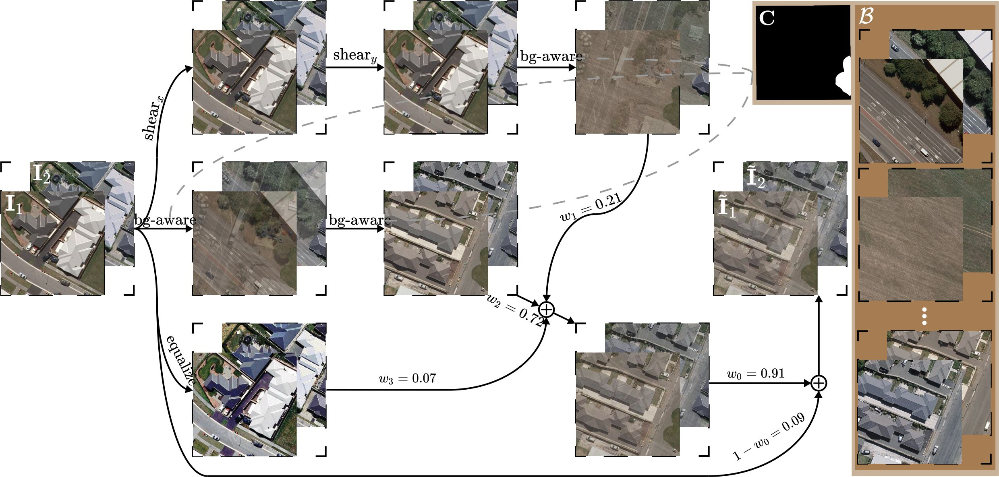
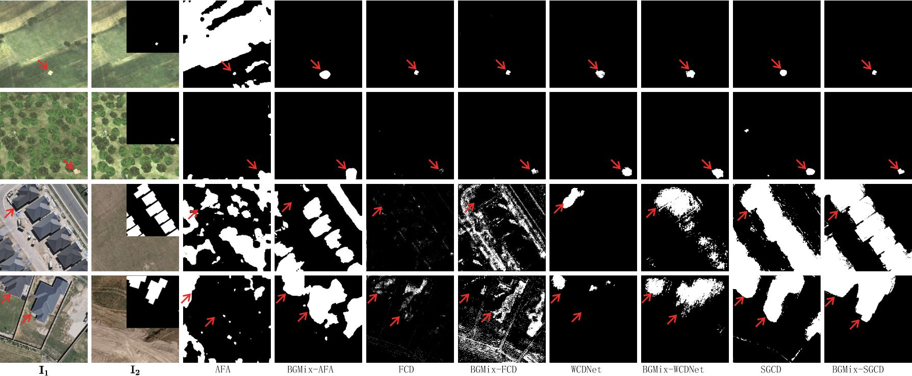
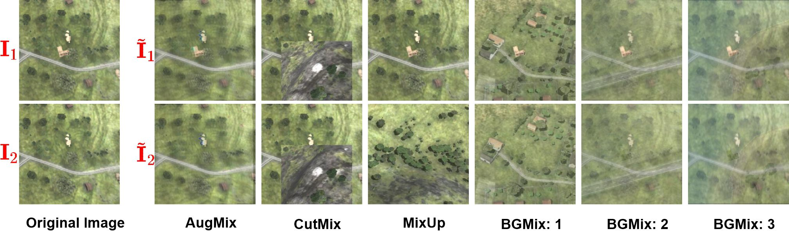

# BGMix in PyTorch

Implementation of "Background-Mixed Augmentation for Weakly Supervised Change Detection" in PyTorch

## &#x1F4D6;Pipeline of the BGMix
<!--  -->


<!-- ## &#x1F4D6;Visual comparison of CD results -->
<!--  -->
<!--  -->


## &#x1F4D6;Requirements

```
- python 3.9
- pytorch 1.9.1
- opencv-python 4.5.5.64
- torchvision 0.10.1
- pillow 9.1.1
```

## &#x1F4D6;Environment
You can create a virtual conda environment named bgmix with the following cmd:
```
conda create -n bgmix python=3.9
conda activate bgmix
pip3 install -r requirement.txt
```

## &#x1F4D6;Train
You can use the following command to train：
> python train.py 

- `train.py`: the entry point for training.
- `models/CG.py`: defines the architecture of the Generator models and Discriminator models.
- `options.py`: creates option lists using `argparse` package.
- `datasets.py`: process the dataset before passing to the network.
- `models/vgg16.py`: defines the Classifier.
- `models/models.py`: defines the model.
- `optimizer.py`: defines the optimizetion.
- `loss.py`: defines the loss functions.


### &#x1F4D4;Test
You can use the following command to test：
> python test.py 

### &#x1F4D4;Pretrained Classifier
Because of perception similarity loss, you need to use the following command to train the Classifier firstly.
> python train_Classifier.py


## &#x1F4D6;Dataset Preparation

### &#x1F4D4;Data structure
- `train_data`: The data for training.
  - `AICD`:  Aerial image change detection.
    - `C`: Change images.
    - `UC`: Background images.
  - `BCD`: Building change detection dataset.
    - `C`: Change images.
    - `UC`: Background images.
- `test_data`: The data for testing.
  - `AICD`:  Aerial image change detection.
    - `C`: Change images.
  - `BCD`: Building change detection dataset.
    - `C`: Change images.

### &#x1F4D4;Data Download 
You can download AICD datasets from [**The Aerial Imagery Change Detection (AICD) dataset**](https://computervisiononline.com/dataset/1105138664)

You can download BCD datasets from [**WHU Building change detection Dataset**](https://study.rsgis.whu.edu.cn/pages/download/building_dataset.html)

## &#x1F4D6;Visualization results
### &#x1F4D4;Examples of augmented image pairs
- AICD

- BCD


### &#x1F4D4;Examples of CD results
- AICD

- BCD
